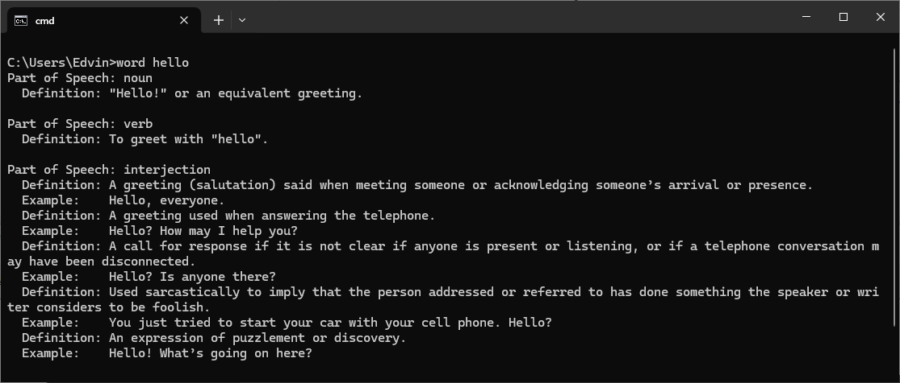

# Word Definition Lookup Tool

## Overview

This tool is a simple Windows command-line application that allows users to look up the definitions of English words. It queries the online dictionary API (DictionaryAPI.dev) and presents the meanings, including parts of speech, definitions, examples, and other related information in a clean, readable format.

All credit for the dictionary API goes to [DictionaryAPI.dev](https://dictionaryapi.dev/), which provides a free and open API for fetching word definitions. This tool simply acts as a user-friendly interface to access the API's data.



## Features

- Look up English word definitions quickly from the command line.
- Displays detailed definitions, including parts of speech, meanings, and usage examples.
- Gracefully handles errors like unknown words or network issues, providing user-friendly feedback.
- Excludes empty data fields (e.g., missing synonyms) for clarity.

## Installation

1. Ensure Python is installed on your system and accessible in your PATH. You can download Python from [the official website](https://www.python.org/downloads/).

2. Install the `requests` library, which is required for the script to fetch data from the API. You can install it using pip:

   ```
   pip install requests
   ```

3. Clone this repository or download the source code to a local directory, for example, `C:\source\word`.

4. Create a `.cmd` file named `word.cmd` in a directory that is in your PATH (e.g., `C:\cmd`). Add the following content to this file:

   ```
   @echo off
   python "C:\source\word\word.py" %*
   ```

   Ensure the path `C:\source\word\word.py` points to where the `word.py` script is located on your system.

5. Make sure the directory containing `word.cmd` is added to your system's PATH. This allows you to run the `word` command from anywhere in the Command Prompt.

## Usage

To look up a word, simply open your command prompt and type:

```
word <your_word_here>
```

Replace `<your_word_here>` with the word you wish to look up. For example:

```
word hello
```

This command will fetch and display the definitions, usage examples, and related information for the word "hello".

## Troubleshooting

- Ensure your internet connection is active while using this tool as it fetches data from an online API.
- Verify that Python and the `requests` library are correctly installed and accessible in your system's PATH.
- If you encounter any permission issues, ensure that the script and the command directory have the appropriate permissions set.

## Contributing

Feel free to fork the repository, make improvements, or customize the script to suit your needs. Pull requests for improvements and bug fixes are welcome!

---

Feel free to customize this README.md to better fit your project's specifics or personal preferences. Once you're satisfied, you can add this file to your Git repository for the application.